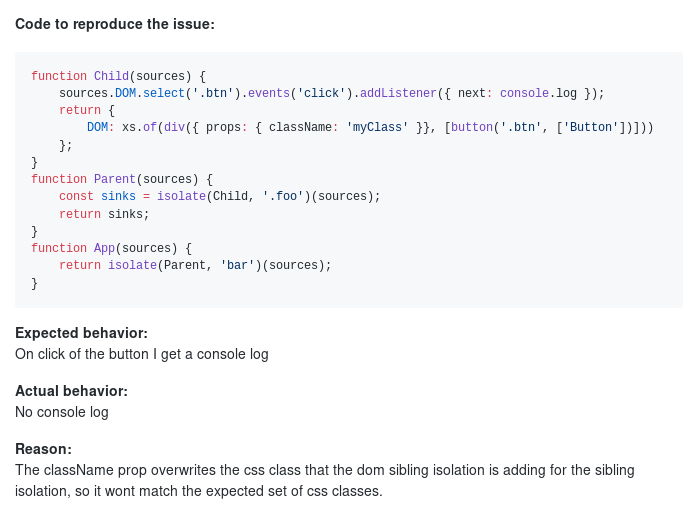

# Internals of a framework

The why and how of the new Cycle.js DOM driver

----

## The problem - Issue [#758](https://github.com/cyclejs/cyclejs/issues/758)

----

## The reason - CSS classes

----

## The goal - Less duct tape

> - Unify how the different isolation methods work
> - Have no visible trace of the internal functionality
> - Remove undefined and surprising behavior (using a certain scope breaks isolation)
> - Be extendable in the future
> - Improve performance (or at least keep it on par)

----

## Taking a step back

What is DOM isolation at its core?
