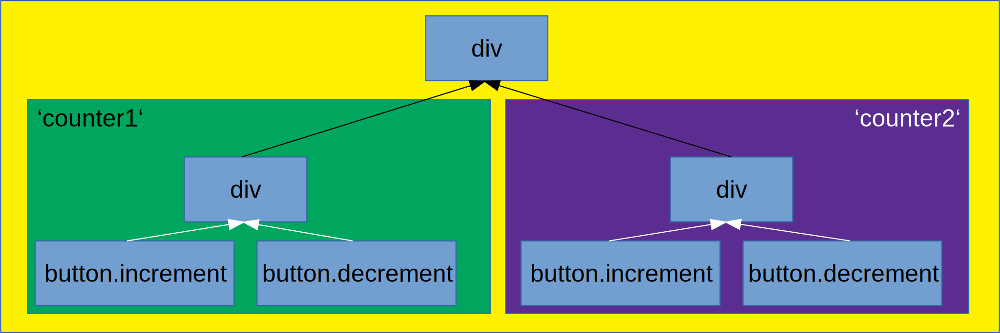
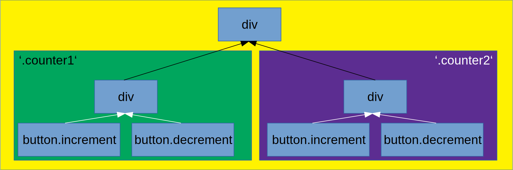

<style>
.yellow {
    color: yellow;
}
div.sourceCode {
    margin: 0 !important;
}
.reveal pre code {
    max-height: 100% !important;
}
div.slides {
    width: 1050px !important;
}
</style>

# <span class="yellow">Internals of a framework</span>


The why and how of the new Cycle.js DOM driver

----

## <span class="yellow">What</span> is isolation?

```js
function Counter(sources) {
    const increment$ = sources.DOM.select('.increment')
        .events('click').mapTo(+1);

    const increment$ = sources.DOM.select('.decrement')
        .events('click').mapTo(-1);

    const state$ = xs.fold((last, curr) => last + curr, 0);

    const view$ = state$.map(count => div([
        span(['Count: ' + count']),
        button('.increment'),
        button('.decrement')
    ]));

    return {
        DOM: view$
    };
}
```

----

## <span class="yellow">What</span> is isolation?

```js
function Main(sources) {
    const counter1 = Counter(sources);
    const counter2 = Counter(sources);

    const view$ = xs.combine(counter1.DOM, counter2.DOM)
        .map(children => div(children));

    return {
        DOM: view$
    };
}
```

----

## Resulting app


----

## <span class="yellow">Reason</span>

```js
function Counter(sources) {
    const increment$ = sources.DOM.select('.increment')
        .events('click').mapTo(+1);
    
    // ...
}
```


----

## Solution: <span class="yellow">Isolation!</span>

```diff
function Main(sources) {
-    const counter1 = Counter(sources);
+    const counter1 = isolate(Counter, 'counter1')(sources);
-    const counter2 = Counter(sources);
+    const counter2 = isolate(Counter, 'counter2')(sources);

    const view$ = xs.combine(counter1.DOM, counter2.DOM)
        .map(children => div(children));

    return {
        DOM: view$
    };
}
```

----

## Solution: <span class="yellow">Isolation!</span>


----

## <span class="yellow">Total</span> isolation

> - Yellow div: no events
> - Green div: events from both child buttons
> - Purple div: events from both child buttons



----

## <span class="yellow">Sibling</span> isolation

> - Yellow div: all events
> - Green div: events from both child buttons
> - Purple div: events from both child buttons



----

## <span class="yellow">The problem</span> - Issue [#758](https://github.com/cyclejs/cyclejs/issues/758)


----

## <span class="yellow">The reason</span> - CSS classes


----


----

## <span class="yellow">The goal</span> - Less duct tape

> - Unify how the different isolation methods work
> - Have no visible trace of the internal functionality
> - Remove undefined and surprising behavior (using a certain scope breaks isolation)
> - Be extendable in the future
> - Improve performance (or at least keep it on par)

----

## Rewriting everything <span class="yellow">step</span> by <span class="yellow">step</span>

----

## Step one: <span class="yellow">Rendering</span>

> - Solved Problem: VDOM Diffing
> - [Snabbdom](https://github.com/snabbdom/snabbdom)
> - `patch :: VDOM -> IO ()`, updates existing DOM to match VDOM

----

## Step two: Isolation <span class="yellow">scopes</span>

- <span class="yellow">Where</span> can we actually do something?

```js
const isolatedComponent = isolate(Component, scope);

// If isolation was just for the DOM
function isolate(component, scope) {
    return function(sources) {
        const newSource = sources.DOM
            .isolateSource(sources.DOM, scope);
        const sinks = component({
            ...sources,
            DOM: newSource
        });
        return {
            ...sinks,
            DOM: sources.DOM.isolateSink(sinks.DOM, scope)
        };
    }
}
```

----

## Step two: Isolation <span class="yellow">scopes</span>

- <span class="yellow">Where</span> can we actually do something?

```js
isolateSource :: (SourceObj, Scope) -> SourceObj

isolateSink :: (Stream VDOM, Scope) -> Stream VDOM
```

----

## Step two: Isolation <span class="yellow">scopes</span>

- Idea: Save <span class="yellow">namespace</span> in source and in output VDOM

```js
class DOMSource
    constructor(namespace) {
        this.namespace = namespace;
    }

    function isolateSource(oldSource, scope) {
        return new DOMSource(oldSource.namespace.concat(scope));
    }

    function isolateSink(sinkStream, scope) {
        return sinkStream.map(rootNode => ({
            ...rootNode,
            data: {
                ...rootNode.data,
                isolate: this.namespace.concat(scope)
            }
        }));
    }
}
```

----

# Step three: <span class="yellow">Event management</span>

----

## Building the <span class="yellow">bridge</span> between APIs

> - The DOM API for <span class="yellow">events</span> looks like `element.addEventListener(type, callback)`
> - We want it to look like `sources.DOM.events(type)`
> - We want events not to <span class="yellow">bubble</span> outside of their scopes

----

## Bubbling 
