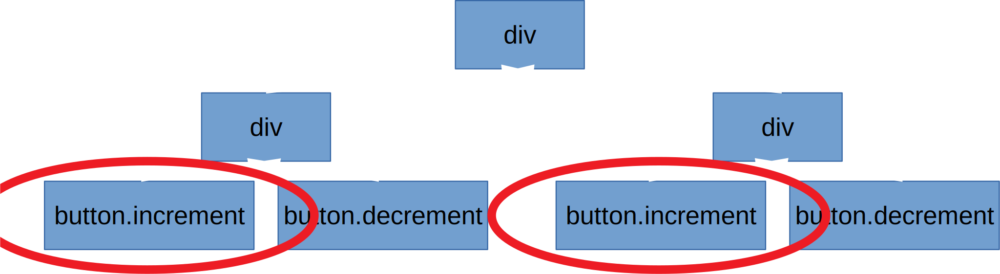
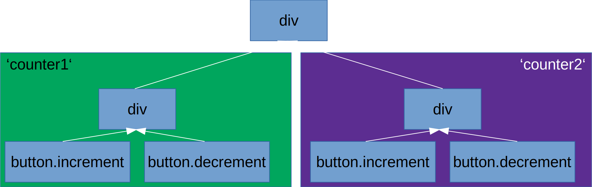

# <span class="yellow">Internals of a framework</span>

<style>
.yellow {
    color: yellow;
}
div.sourceCode {
    margin: 0 !important;
}
.reveal pre code {
    max-height: 100% !important;
}
</style>

The why and how of the new Cycle.js DOM driver

----

## What is isolation?

```js
function Counter(sources) {
    const increment$ = sources.DOM.select('.increment')
        .events('click').mapTo(+1);

    const increment$ = sources.DOM.select('.decrement')
        .events('click').mapTo(-1);

    const state$ = xs.fold((last, curr) => last + curr, 0);

    const view$ = state$.map(count => div([
        span(['Count: ' + count']),
        button('.increment'),
        button('.decrement')
    ]));

    return {
        DOM: view$
    };
}
```

----

## What is isolation?

```js
function Main(sources) {
    const counter1 = Counter(sources);
    const counter2 = Counter(sources);

    const view$ = xs.combine(counter1.DOM, counter2.DOM)
        .map(children => div(children));

    return {
        DOM: view$
    };
}
```

----

## Resulting app


----

## Reason

```js
function Counter(sources) {
    const increment$ = sources.DOM.select('.increment')
        .events('click').mapTo(+1);
    
    // ...
}
```



----

## Solution: Isolation!

```diff
function Main(sources) {
-    const counter1 = Counter(sources);
+    const counter1 = isolate(Counter, 'counter1')(sources);
-    const counter2 = Counter(sources);
+    const counter2 = isolate(Counter, 'counter2')(sources);

    const view$ = xs.combine(counter1.DOM, counter2.DOM)
        .map(children => div(children));

    return {
        DOM: view$
    };
}
```

----

## Solution: Isolation!



----

## Total isolation

> - Yellow div: no events
> - Green div: events from both child buttons
> - Purple div: events from both child buttons


----

## Sibling isolation

> - Yellow div: all events
> - Green div: events from both child buttons
> - Purple div: events from both child buttons


----

## <span class="yellow">The problem</span> - Issue [#758](https://github.com/cyclejs/cyclejs/issues/758)


----

## <span class="yellow">The reason</span> - CSS classes


----


----

## <span class="yellow">The goal</span> - Less duct tape

> - Unify how the different isolation methods work
> - Have no visible trace of the internal functionality
> - Remove undefined and surprising behavior (using a certain scope breaks isolation)
> - Be extendable in the future
> - Improve performance (or at least keep it on par)

----
