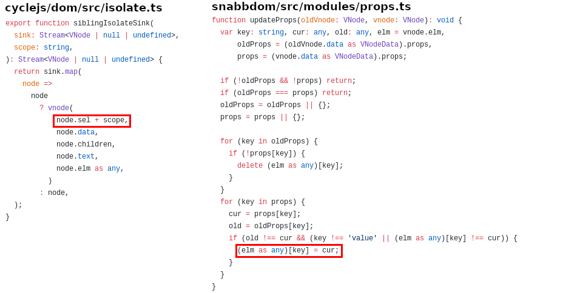

# <span class="yellow">Internals of a framework</span>

<style>
.yellow {
    color: yellow;
}
div.sourceCode {
    margin: 0 !important;
}
.reveal pre code {
    max-height: 100% !important;
}
div.slides {
    width: 1050px !important;
}
</style>

The why and how of the new Cycle.js DOM driver

----

## <span class="yellow">What</span> is isolation?

```js
function Counter(sources) {
    const increment$ = sources.DOM.select('.increment')
        .events('click').mapTo(+1);

    const increment$ = sources.DOM.select('.decrement')
        .events('click').mapTo(-1);

    const state$ = xs.fold((last, curr) => last + curr, 0);

    const view$ = state$.map(count => div([
        span(['Count: ' + count']),
        button('.increment'),
        button('.decrement')
    ]));

    return {
        DOM: view$
    };
}
```

----

## <span class="yellow">What</span> is isolation?

```js
function Main(sources) {
    const counter1 = Counter(sources);
    const counter2 = Counter(sources);

    const view$ = xs.combine(counter1.DOM, counter2.DOM)
        .map(children => div(children));

    return {
        DOM: view$
    };
}
```

----

## Resulting app


----

## <span class="yellow">Reason</span>

```js
function Counter(sources) {
    const increment$ = sources.DOM.select('.increment')
        .events('click').mapTo(+1);
    
    // ...
}
```


----

## Solution: <span class="yellow">Isolation!</span>

```diff
function Main(sources) {
-    const counter1 = Counter(sources);
+    const counter1 = isolate(Counter, 'counter1')(sources);
-    const counter2 = Counter(sources);
+    const counter2 = isolate(Counter, 'counter2')(sources);

    const view$ = xs.combine(counter1.DOM, counter2.DOM)
        .map(children => div(children));

    return {
        DOM: view$
    };
}
```

----

## Solution: <span class="yellow">Isolation!</span>


----

## <span class="yellow">Total</span> isolation

> - Yellow div: no events
> - Green div: events from both child buttons
> - Purple div: events from both child buttons


----

## <span class="yellow">Sibling</span> isolation

> - Yellow div: all events
> - Green div: events from both child buttons
> - Purple div: events from both child buttons


----

## <span class="yellow">The problem</span> - Issue [#758](https://github.com/cyclejs/cyclejs/issues/758)


----

## <span class="yellow">The reason</span> - CSS classes



----


----

## <span class="yellow">The goal</span> - Less duct tape

> - Unify how the different isolation methods work
> - Have no visible trace of the internal functionality
> - Remove undefined and surprising behavior (using a certain scope breaks isolation)
> - Be extendable in the future
> - Improve performance (or at least keep it on par)

----

## Rewriting - <span class="yellow">Data structure</span> first

<span class="yellow">What</span> do we need to know <span class="yellow">where</span> and <span class="yellow">when</span>?

How can we <span class="yellow">optimze</span> for that?

----

## Short digression - Event <span class="yellow">bubbling</span>


----

## Short digression - Event <span class="yellow">bubbling</span>


----

## Start bottom up

> - What do we <span class="yellow">have</span> to work with?
> - `element.addEventListener(type, callback)`
> - can't use <span class="yellow">native bubbling</span>: `root.addEventListener(type, callback)`

----

## Start <span class="yellow">bottom up</span>

> - <span class="yellow">When</span> an event is triggered, <span class="yellow">what</span> do we know?
> - `callback :: Event -> IO ()`
> - We can get the <span class="yellow">element</span> the event was triggered on
> - How to know the right <span class="yellow">isolation scope</span>?
> - We need a <span class="yellow">mapping</span> `Element -> namespace`

----

## <span class="yellow">Hooking</span> into the VDOM

Solution: <span class="yellow">Snabbdom modules</span>

```js
var myModule = {
  create: function(emptyVnode, vnode) {
    // invoked whenever a new virtual node is created
    // the actual DOM element is under vnode.elm
  },
  update: function(oldVnode, vnode) {
    // invoked whenever a virtual node is updated
  },
  delete: function(vnode) {
    // invoken whenever a DOM node is removed
  }
};
```
We need to <span class="yellow">attach</span> the isolation scope to the <span class="yellow">vnode</span>

----

## <span class="yellow">Where</span> can we do that?

```js
function isolate(component, scope) {
    return function(sources) {
        const newDom = sources.DOM
            .isolateSource(sources.DOM, scope);

        const sinks = component({
            ...sources,
            DOM: newDOM
        });

        return {
            ...sinks,
            DOM: sources.DOM.isolateSink(sinks.DOM, scope)
        };
    }
}
```

----

## <span class="yellow">Where</span> can we do that?

```js
class DOMSource {
    constructor(namespace) {
        this.namespace = namespace;
    }

    isolateSource(source, scope) {
        return new DOMSource(source.namespace.concat(scope));
    }

    isolateSink(vdomStream, scope) {
        return vdomStream.map(rootNode => ({
            ...rootNode,
            data: {
                ...rootNode.data,
                isolate: this.namespace.concat(scope)
            }
        }));
    }
}
```

----

## <span class="yellow">Where</span> can we do that?

```js
type Namespace = Array<Scope>;
const namespaceMap = new Map<Element, Namespace>();

const isolateModule = {
    create(emptyVnode, vnode) {
        if(vnode.data.isolate) { // is isolation root
            namespaceMap.set(vnode.elm, vnode.data.isolate);
        }
    },
    destroy(vnode) {
        namespaceMap.delete(vnode.elm)
    }
};
```

----

## Short <span class="yellow">Overview</span>


----

## <span class="yellow">Delivering</span> events


----

## <span class="yellow">Data structures</span> to the rescue

> - We need to save our <span class="yellow">virtual</span> event listeners
> - And the `Namespace -> Element` <span class="yellow">mapping</span>
> - <span class="yellow">Efficiently</span>

----

## Solution: A <span class="yellow">tree</span>

```js
type Node<Payload> = [Payload, InternalTree];
interface InternalTree<Payload> {
    [scope: string]: Node<Payload>;
}
```

```hs
data Node a = Node a (Map String (Node a))
```

----

<style>
img[src="images/event_handling_3.svg"] {
    margin-top: -1.35em !important;
}
</style>


----


----

## Again an <span class="yellow">overview</span>


----

# <span class="yellow">Questions?</span>

#### Links

- Slide repo: [https://github.com/jvanbruegge/dom-driver-internals](https://github.com/jvanbruegge/dom-driver-internals)
- Cycle.js: [https://github.com/cyclejs/cyclejs](https://github.com/cyclejs/cyclejs)
- Cycle.js & React compatibility <span class="yellow">(NEW!)</span>: [https://staltz.com/use-react-in-cyclejs-and-vice-versa.html](https://staltz.com/use-react-in-cyclejs-and-vice-versa.html)

----

## Come to <span class="yellow">CycleConf</span>!

- 17th - 19th of October
- Copenhagen
- [http://cycleconf.com/](http://cycleconf.com/)
